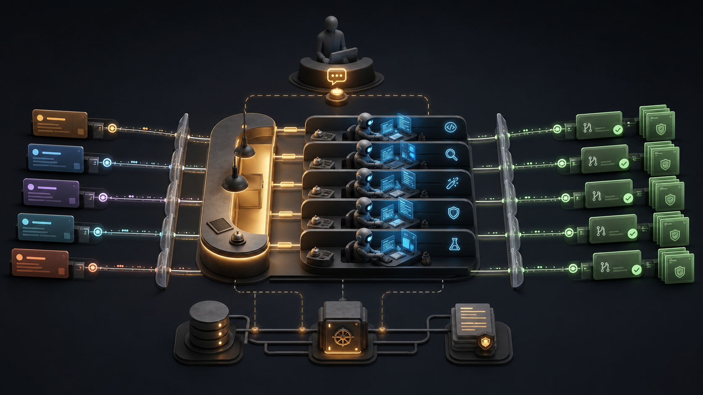

# Dark Kitchen

[](https://github.com/matpeltier/dark-kitchen-orchestrator/actions/workflows/ci.yml)
[](https://www.npmjs.com/package/dark-kitchen)
[](https://github.com/matpeltier/dark-kitchen-orchestrator/releases)
[](package.json)
[](LICENSE)

Dark Kitchen is a self-hosted control plane for autonomous software work. It watches a tracker, selects ready tasks, gives each task an isolated Git worktree, routes semantic workflow roles to coding harnesses, and owns the PR/CI/merge lifecycle. When automation cannot safely continue, it creates a durable intervention and routes the human reply back to the waiting control plane.

It is deliberately not another coding-agent UI. Trackers, source control, harnesses, messaging channels, PM clients, verification providers, and persistence are replaceable layers.

> **Status:** pre-1.0 and under active development. The deterministic core and adapter boundaries have automated coverage, but the current daemon does not yet reconcile active runs/sessions after a process crash, reconnect replacement agent sessions to an interrupted workflow call, or implement remote execution nodes. Linear/Jira and real provider/channel paths also still require live commissioning. Do not enable unattended merge from this revision.



The image was generated for this project. Its reproducible prompt metadata is in [`docs/assets/dark-kitchen-architecture.prompt.md`](docs/assets/dark-kitchen-architecture.prompt.md).

## The invariant that keeps work isolated

**One active task gets exactly one primary Git worktree.** A workflow may run multiple role-specific agents inside that worktree—implementer, reviewer, fixer, repository tester, verifier—but two active tasks never share a primary worktree. Retries reuse the task worktree and durable journal; cleanup happens only after the SCM and tracker lifecycle reaches a safe terminal state.

## What the control plane does

- Normalizes GitHub Issues, Linear, and Jira work into one task/dependency model.
- Schedules only ready tasks whose native blocker edges are complete, with bounded concurrency.
- Runs dynamic, journaled workflows whose roles are independent of harness and model names.
- Uses ACP through the pinned `acpx` runtime for persistent Codex/OpenCode-compatible sessions.
- Selects the bundled DeepSeek Harness adapter for explicit user-managed `deepseek-harness` profiles, without rewriting DSH plugins, skills, MCP settings, credentials, or model configuration.
- Exposes an allowlisted native/custom harness contract for embedding hosts.
- Runs a bounded implement → independent review → fix → repository-test workflow.
- Owns branch push, idempotent PR creation, configured CI gates, merge policy, tracker transition, and worktree release.
- Persists runs, sessions, interventions, verification metadata, and completed workflow-call results for audit and explicit replay; daemon-start reconciliation remains incomplete.
- Exposes PM and runtime controls over MCP on local stdio or authenticated HTTP.
- Sends interventions through direct Telegram, Discord, Slack, iMessage, or WhatsApp transports; an OpenClaw gateway adapter is also available to embedders.
- Separates verification requirements from machine capabilities and requires approval before managed tools change the host.

## Quick start

### Prerequisites

- Node.js 22.13 or later and Git.
- An existing Git repository with an `origin` remote.
- Credentials for one tracker and GitHub SCM.
- At least one installed and authenticated coding harness. The default daemon path uses ACP/acpx; the package pins the supported acpx runtime dependency.

Install the CLI, then initialize from the root of the repository you want Dark Kitchen to manage:

```sh
npm install --global dark-kitchen
cd /path/to/existing-project
dark-kitchen init
```

`init` creates `.dark-kitchen/config.yaml` only when it does not already exist; it does not replace unrelated project files. `dark-kitchen setup` is the interactive alternative—review its overwrite prompt before accepting it.

Set credential values in the environment, never in YAML:

```sh
export GITHUB_TOKEN='...'
export TELEGRAM_BOT_TOKEN='...' # optional
```

Edit the generated config and run the preflight:

```sh
dark-kitchen doctor
dark-kitchen start --foreground
```

The daemon polls every 30 seconds. With the default GitHub Issues adapter, adding `dk:ready` to an issue makes it eligible after its blockers are complete.

See [installation](docs/installation.md) for npm, source, Docker, systemd, launchd, upgrades, and storage paths.

## Minimal configuration

This example explicitly maps every role used by the built-in workflow. Model IDs are examples; choose IDs accepted by the selected harness.

```yaml
version: 1

trackers:
  - id: work
    kind: github-issues
    owner: my-org
    repo: my-project
    tokenEnv: GITHUB_TOKEN

repositories:
  - id: source
    kind: github
    owner: my-org
    repo: my-project
    defaultBranch: main
    tokenEnv: GITHUB_TOKEN

harnessProfiles:
  - managed: true
    id: codex-main
    kind: codex
    model: gpt-5.6-codex
    instructions: Run targeted tests and inspect the final diff.

roles:
  - id: implementer
    harnessProfileId: codex-main
  - id: reviewer
    harnessProfileId: codex-main
  - id: fixer
    harnessProfileId: codex-main
  - id: repository-tester
    harnessProfileId: codex-main
  - id: verifier
    harnessProfileId: codex-main

workflows:
  - id: default
    builtin: default
    default: true
    roles: [implementer, reviewer, fixer, repository-tester, verifier]

concurrency:
  maxParallelTasks: 2
  maxParallelWorkflows: 2

mergePolicy:
  strategy: squash
  requiredChecks: [ci]
  requireApproval: true
  deleteHeadBranchAfterMerge: true

channels:
  - id: telegram-owner
    kind: telegram
    tokenEnv: TELEGRAM_BOT_TOKEN
    defaultTarget: '123456789'
```

Configuration validates known field types, detects duplicate IDs and dangling references, rejects inline secrets, and is written atomically. Full reference: [configuration](docs/configuration.md).

## Daily autopilot flow

1. A PM creates small tracker tasks with observable acceptance criteria and native dependency edges.
2. The PM marks only fully specified tasks ready; for GitHub Issues this is the `dk:ready` label.
3. Dark Kitchen allocates or reuses the task's primary worktree and run journal.
4. The workflow resolves each semantic role to the configured harness profile. Agent payloads travel through stdin, IPC, or file references—not shell interpolation.
5. Implementation is independently reviewed, fixed if needed, and checked by a repository-tester role within bounded loops.
6. If the task declares verification, the configured profile and capability state determine whether evidence can be produced. Blocking proof must be durable before merge.
7. Dark Kitchen pushes the branch, creates or reuses one PR, records tests/review/evidence in the PR context, and enforces CI/approval policy.
8. On the validated happy path, a confirmed merge transitions the tracker task and releases the worktree. Crash recovery and post-merge reconciliation are not yet complete enough for unattended operation.

## ChatGPT or another PM client

The PM connects to Dark Kitchen MCP—not directly to the coding-agent terminals. It can inspect the task graph and runtime, create/update tasks, configure roles, approve automation, discuss interventions, and request audited run/session controls after the human answers. A replacement session is currently recorded correctly but is not yet reattached to an already interrupted workflow promise after a daemon/process failure.

There are two distinct authority boundaries:

| Operation                                                                                                                   | Use                                             |
| --------------------------------------------------------------------------------------------------------------------------- | ----------------------------------------------- |
| Create/update/close work items, dependencies, autonomous approval, config, interventions, runtime and verification controls | Dark Kitchen MCP (`dk_*`)                       |
| Read repository files/history, commits, PR reviews, checks, and CI logs                                                     | A separate GitHub connector or GitHub UI        |
| Push branches, open/reuse PRs, merge, close tracker task                                                                    | Dark Kitchen's configured SCM/tracker lifecycle |

Even when GitHub supplies both Issues and Git hosting, **Tracker is not SCM**. A PM should not bypass Dark Kitchen policy by mutating issue state with the GitHub connector.

For PM/runtime controls, connect the client to the running daemon's Streamable HTTP MCP endpoint at `http://127.0.0.1:18801/mcp`; that process owns the live supervisor, agent, verification, capability, tracker, and intervention services. Do not expose it beyond loopback without the authentication and allowlist controls documented in [MCP](docs/mcp.md).

`dark-kitchen mcp` is a reduced stdio planning surface built from a config snapshot. It is useful for validation and limited tracker/intervention access, but it is not the live autopilot control plane and intentionally returns `service_unavailable` for services it does not own. The companion [`dark-kitchen-pm` skill](skills/dark-kitchen-pm/SKILL.md) describes the safe PM sequence.

Typical PM controls are explicit service calls rather than terminal keystrokes:

```text
dk_list_agents({ runId })
dk_send_instruction({ sessionId, instruction })       # running session with live-input support
dk_interrupt_agent({ sessionId, instruction })        # cancel current turn, then redirect
dk_resolve_intervention({ interventionId, action, resolvedBy, answer })
dk_retry_agent({ sessionId })                          # failed durable workflow call
dk_switch_agent_profile({ sessionId, harnessProfileId })
```

Each unsupported operation fails explicitly according to the selected runtime's capabilities. Resolve the human decision first, then use only a control supported by that runtime. Task retry is the currently reliable daemon path; exact workflow-call continuation across process restarts is still unfinished.

## Human intervention loop

An auth failure, quota limit, product decision, approval, or repeated failure creates a typed durable intervention. Notifications contain a short correlation code. A direct reply to the provider message is correlated automatically; a PM may also resolve the intervention by code through MCP. Duplicate replies are idempotent.

- `retry` resumes the paused task and makes it eligible again.
- `stop` keeps it blocked across daemon restarts.
- `approve` records an audited approval; capability installation still requires the matching reviewed plan and approval IDs.
- Any other non-empty text is preserved as the human answer for the PM/agent.

Telegram uses polling by default and asks the provider not to drop pending updates; authenticated HTTPS webhook mode is also configurable. Outbound correlations and inbound replay receipts are stored in the runtime SQLite database, so an exact reply/code can still resolve after a daemon restart. Configure `defaultTarget` as an inbound conversation allowlist, add `allowedSenderIds` in shared chats, keep tokens/secrets in their named environment variables, and test restart delivery before unattended use. Discord, Slack, and WhatsApp are opt-in peer integrations: install respectively `discord.js@14.27.0`, `@slack/bolt@3.22.0`, or `whatsapp-web.js@1.34.7` beside the CLI only on nodes that enable them. WhatsApp additionally needs QR pairing and preserved user-owned auth state; Dark Kitchen polls the self-chat because the upstream client does not emit all self-message reply events. iMessage is macOS-only. A channel outage does not delete the intervention.

OpenClaw remains an optional gateway integration at the channel-package boundary. The current CLI daemon composes the direct transports above; deployments embedding the OpenClaw adapter must keep its pairing and allowlist boundary intact. Details and edge cases: [interventions](docs/interventions.md).

## Harnesses and workflows

Workflow code names semantic roles only. The same call graph can route an implementer to Codex, a reviewer to OpenCode, and a fixer to another compatible runtime without importing those providers into the workflow engine.

| Runtime path           | Current contract                                                                                                                                                                                                                            |
| ---------------------- | ------------------------------------------------------------------------------------------------------------------------------------------------------------------------------------------------------------------------------------------- |
| ACP/acpx               | Primary daemon integration; runtime sessions expose resume, cancel, live instructions, model selection, and isolated MCP injection. Codex/OpenCode boundaries are covered by compatibility tests; daemon restart restoration is incomplete. |
| Native/custom plugin   | Public allowlisted plugin contract; shell-free one-shot process adapter available. User-managed profiles must not be mutated. Host composition is required.                                                                                 |
| DeepSeek Harness (DSH) | Bundled adapter for an explicitly installed supported DSH developer preview. The stock daemon selects `kind: deepseek-harness`; execution is one-shot plus cancellation and preserves DSH config.                                           |

The workflow engine provides phases, parallel branches, pipelines, nested workflows, bounded retries, cancellation, concurrency limits, deterministic call identities, and journal replay. See [workflows](docs/workflows.md) and [harnesses](docs/harnesses.md).

## Verification and capability safety

Tasks describe **what** must be proven. Project config describes **how** the installation can prove it.

```markdown
## Verification

Profile: web-e2e
Evidence: screenshot, trace

### Scenario: Sign in

Expect: The dashboard is visible and the browser reports no console error.
```

The first-party catalog is intentionally small:

| Capability           | Ownership        | Current behavior                                                                                               |
| -------------------- | ---------------- | -------------------------------------------------------------------------------------------------------------- |
| `browser.playwright` | managed          | Pinned Playwright + Chromium in Dark Kitchen tool storage; real browser launch health probe.                   |
| `mobile.maestro`     | managed          | Checksum-verified pinned Maestro CLI; an already available Android/iOS device remains a separate prerequisite. |
| `api.http`           | built in         | Local structured HTTP request/status/body verification; no project dependency.                                 |
| `command.exec`       | project-provided | Explicit executable and argument array through the safe process API; no shell evaluation.                      |

Managed provisioning is two-step: inspect/plan, resolve the generated approval intervention, then ensure the exact `planId` + `approvalId`. Planning never installs. User-managed and project-provided tools are not overwritten. For a task with one configured `Profile:`, the stock daemon inspects its capabilities, runs the verifier workflow, stores the normalized verdict/evidence references, and passes a blocking proof to the PR lifecycle. Evidence references are metadata, not proof that an artifact exists; keep independent required CI checks enabled. See [configuration](docs/configuration.md), [workflows](docs/workflows.md), and [MCP](docs/mcp.md).

## GitHub Issues + GitHub SCM example

1. Configure `kind: github-issues` under `trackers` and `kind: github` under `repositories`; they may use the same `GITHUB_TOKEN` environment variable but remain separate adapters.
2. Create issue `#42` with acceptance criteria and, when needed, the portable `## Verification` section.
3. Add native dependency edges through `dk_add_dependency`; do not encode them only as prose.
4. Add `dk:ready`. Dark Kitchen creates a branch/worktree, runs the workflow, and opens or reuses one GitHub PR.
5. The PR waits for the exact configured checks and optional approval. Only after GitHub confirms merge does Dark Kitchen close the issue and release the worktree.

## Linear + GitHub SCM contract example

The Linear and Jira adapters remain experimental: they do not yet satisfy the live CRUD/state/dependency round-trip acceptance tests required for unattended use. The following describes the intended normalized flow, not a production guarantee.

1. Configure a Linear tracker with `workspace` set to the team key and a separate GitHub repository entry.
2. Create Linear issues and blocking relations through Dark Kitchen MCP. The default mapping treats Linear `Todo` as ready, `In Progress` as active, `In Review` as blocked, and `Done` as completed.
3. After live commissioning, Dark Kitchen can schedule the normalized Linear task while creating its branch and PR in GitHub.
4. Keep automatic merge disabled until the installation has proved the final Linear state transition and retry behavior in a disposable workspace.

More detail: [trackers](docs/trackers.md).

## Security model

- Tracker bodies, human replies, prompts, diffs, and agent output are untrusted payload data. They are never interpolated into shell commands.
- Executables and bounded control arguments are separate from stdin/IPC/file payloads; child processes use `shell: false`.
- Tokens stay in environment variables, are redacted from diagnostics, and are not placed in Git remote URLs or process arguments.
- Managed capability changes are pinned, planned, auditable, and approval-gated.
- Custom harness plugins are executable code and require an explicit allowlist in hosts that load them.
- MCP defaults to local-only transports. Remote HTTP requires authentication, host allowlists, HTTPS, and an appropriate reverse proxy/OAuth boundary.
- Keep repository branch protection and required checks enabled; autonomous merge does not replace SCM policy.

Read [SECURITY.md](SECURITY.md) before a non-local deployment.

## CLI

```text
dark-kitchen setup
dark-kitchen init
dark-kitchen doctor
dark-kitchen start --foreground [--json]
dark-kitchen stop
dark-kitchen status
dark-kitchen dashboard [port]
dark-kitchen config get
dark-kitchen mcp
```

`runs`, `agents`, `interventions`, `capabilities`, `cleanup`, and `logs` are present as CLI discovery commands, but rich operational actions live on the daemon/MCP service boundary. Use MCP for production control rather than treating placeholder CLI output as proof that an action ran.

## Documentation

- [Architecture and trust boundaries](docs/architecture.md)
- [Installation, Docker, systemd, launchd, and upgrades](docs/installation.md)
- [Configuration schema and examples](docs/configuration.md)
- [Dynamic workflows and proof lifecycle](docs/workflows.md)
- [ACP/acpx, native/custom, and DeepSeek harnesses](docs/harnesses.md)
- [GitHub Issues, Linear, Jira, and SCM separation](docs/trackers.md)
- [Human interventions and messaging edge cases](docs/interventions.md)
- [MCP tools and safe PM sequence](docs/mcp.md)
- [Troubleshooting](docs/troubleshooting.md)
- [Changelog and known limitations](CHANGELOG.md)
- [Contributing](CONTRIBUTING.md), [security](SECURITY.md), and [code of conduct](CODE_OF_CONDUCT.md)

## Development

```sh
git clone https://github.com/matpeltier/dark-kitchen-orchestrator.git
cd dark-kitchen-orchestrator
corepack enable
pnpm install --frozen-lockfile
pnpm validate
```

The default CI runs lint, formatting, typecheck, tests, build, package-manifest validation, documentation-link checks, npm-tarball smoke, and container smoke where configured. Tests use fake provider boundaries by default; a passing deterministic suite does not prove that your local external credentials or live LLM/channel are healthy.

## License and attribution

Dark Kitchen is MIT licensed. See [LICENSE](LICENSE) and [NOTICE](NOTICE). The workflow engine adapts concepts and code from [`codex-dynamic-workflows`](https://github.com/six-ddc/codex-dynamic-workflows), also MIT; the full upstream notice is retained in [`packages/workflow-engine/NOTICE.md`](packages/workflow-engine/NOTICE.md).
